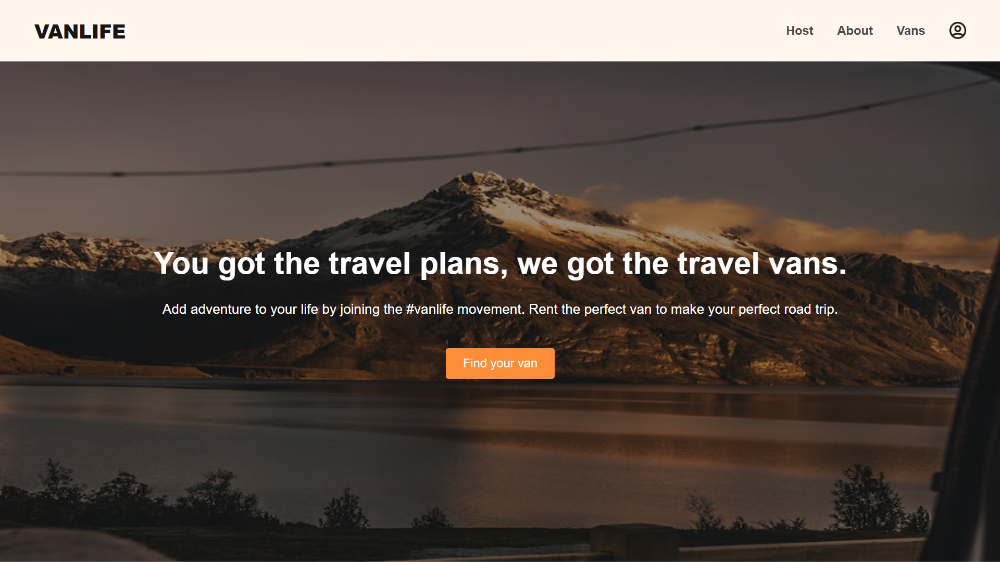

# Vanlife

## 0. Table of Contents

1. [Overview](#1-overview)
2. [Screens in this website](#2-screens-in-this-website)
3. [Tools and technologies used](#3-tools-and-technologies-used)
4. [Live Link](#4-live-link)

## 1. Overview

Vanlife is a static web application that enables users to browse detailed information about available rental vans. It is built with `React` and utilizes `Firebase Firestore` for data storage.

## 2. Screens in this project

- Authentication pages
  - Signup page
  - Login page
- Home page
- About page
- Vans page
- Single van page
- Dashboard page
- Income page
- Host vans page
- Single host van page
- Reviews page

## 3. Tools and technologies used

- Create React App to initialize React project
- Vanilla CSS to style UI components
- React Router v6 to implement client side routing
- Firebase Firestore for data storage
- Vercel for deployment

## 4. Live Link

Vanlife is deployed on Vercel. **Live link** of the deployed project - [click here](https://vanlife-psi.vercel.app/).
